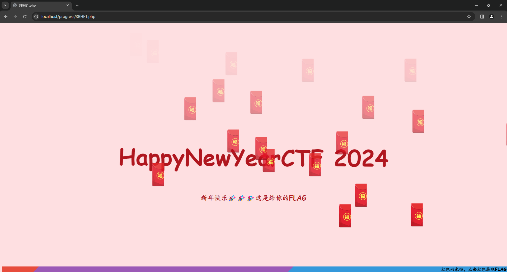
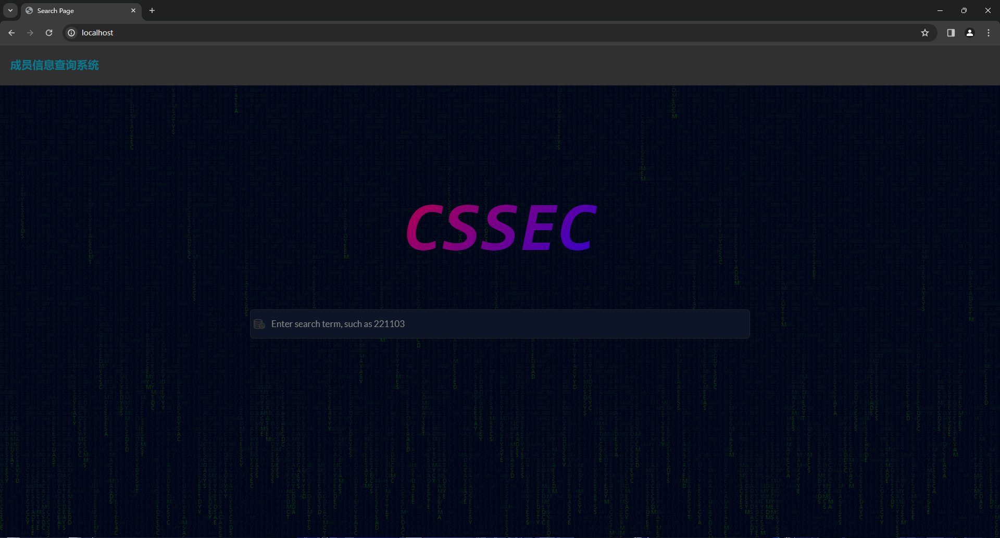

# 项目说明

HappyNewYearCTF2024的题目源码以及Dockerfile, 基于`ctftraining/base_image_nginx_mysql_php_56`镜像。

共设计了3套题目样式：
- HappyNewYear海报背景，
  
- 博客主题样式+文章搜索+文件上传功能，可嵌入文件上传，爆破查找等题型
  
- 搜索引擎样式，主要用于sql注入题型
  

## 项目结构
Web的PHP题目结构都是类似的，必要文件用`*`标记，以一道文件上传的题目为例，其中除了带`*`的文件和upload.php，都是构成博客主题样式的，可以根据
需要自由改动。
当然，也可以不改，在`index.php`中添加一个卡片`<div class="card my-4"></div>`块，并编写PHP的题目文件就可以出好一道简单的题目了。如果需
要增加的PHP文件，只有数据处理的部分，可以单独在一个单独的PHP文件中做数据处理，然后在卡片`<div class="card my-4"></div>`块引用该文件就可
以了，具体可以参考`sqlisea1`中的`search.php`和`result.php`。
```
.
├── * Dockerfile
└── src
    ├── * db.sql
    ├── * flag.sh
    ├── * index.php
    ├── upload.php
    ├── assert
    │   ├── logo_style.css
    │   ├── markdown.css
    │   ├── padding_style.css
    │   └── bootswatch
    │       └── bootstrap.min.css
    ├── md
    │   ├── md.php
    │   └── awd.md    
    ├── model
    │   ├── head
    │   └── tail
    ├── post
    │   └── post.php
    └── uploads
```

## 文件说明

- `Dockerfile`: 用于构建 Docker 镜像的文件。
- `src/db.sql`: 数据库脚本文件，用于初始化数据库，但本题不涉及数据库操作。
- `src/flag.sh`: 用于设置动态FLAG的脚本。将环境变量 `GZCTF_FLAG` 写入到 `/flag` 文件中。最后清空 `GZCTF_FLAG` 环境变量，并删除自己。
- `src/index.php`: 博客的主页，包含文章列表、文章上传和文章搜索等功能。
- `src/md/awd.md`: 示例的 Markdown 文件。
- `src/md/md.php`: 包含用于解析 Markdown 格式的博客文章的函数。
- `src/upload.php`: 处理文件上传的 PHP 脚本。它接收用户上传的文件，检查文件类型和大小，然后将文件保存到服务器。如果文件是 Markdown 格式，它会将文件内容转换为 HTML 格式并保存为一个新的 .html 文件。
- `src/assert/markdown.css`: 定义了 Markdown 文档的样式，包括文本颜色、字体、字号、行高、边距等。此外，它还定义了代码块和引用块的样式。
- `src/assert/logo_style.css`，`src/assert/padding_style.css`，`src/assert/bootswatch/bootstrap.min.css`: 其他 CSS 样式文件。
- `src/model/`: 存放模板文件的文件夹。
- `src/post/`: 存放博客文章的文件夹。
- `src/uploads/`: 存放上传文件的文件夹。

## 如何运行

1. 安装 Docker。
2. 在项目根目录下运行 `docker build -t <your_username>/<image_name> .` 命令。
3. `docker run -d -p 80:80 -p 9000:9000 -e GZCTF_FLAG='flag{this_is_test}' <your_username>/<image_name>`
4. 在浏览器中访问 `http://localhost`。
